# 🚌 KSRTC Connect

A full-stack **bus transportation management system** built with Django, designed for **KSRTC (Kerala State Road Transport Corporation)**. The platform connects administrators, bus drivers, and passengers through a web-based admin panel and RESTful mobile APIs.

---

## 📋 Table of Contents

- [Overview](#overview)
- [Features](#features)
- [Tech Stack](#tech-stack)
- [Project Structure](#project-structure)
- [Prerequisites](#prerequisites)
- [Installation](#installation)
- [Configuration](#configuration)
- [Usage](#usage)
- [API Endpoints](#api-endpoints)
- [User Roles](#user-roles)
- [Database Schema](#database-schema)
- [Screenshots](#screenshots)
- [Contributing](#contributing)
- [License](#license)

---

## 🔍 Overview

KSRTC Connect is a comprehensive transportation management platform that enables:

- **Administrators** to manage routes, stops, buses, fares, bookings, complaints, and feedback via a web dashboard.
- **Bus Drivers** to register, manage their buses and seats, and share real-time GPS locations via a mobile app.
- **Passengers** to search buses, book seats, make payments, submit complaints, and provide feedback via a mobile app.

---

## ✨ Features

### 🛡️ Admin Panel (Web)
- Secure login with password management (change & forgot password)
- **Route Management** — Add, view, edit, and delete bus routes
- **Stop Management** — Add, view, edit, and delete stops along routes
- **Fare Management** — Configure ticket prices between stops
- **Bus & Seat Monitoring** — View all registered buses and their seat configurations
- **Booking Management** — View all passenger bookings
- **Complaint Management** — View complaints and send replies
- **Feedback Management** — View passenger feedback
- **Driver Verification** — View and verify registered bus drivers

### 🚐 Driver Module (Mobile API)
- Driver registration with photo upload and licence verification
- Profile management (view & edit)
- Password management (change & forgot password)
- **Bus Management** — Add, view, edit, and delete buses
- **Seat Management** — Add, view, and edit seats for buses
- **Live Location** — Real-time GPS location updates

### 👤 Passenger Module (Mobile API)
- User registration with photo upload
- Profile management (view & edit)
- Password management (change & forgot password)
- **Bus Search** — Search available buses with live location tracking
- **Seat Booking** — View available seats and book them
- **Payments** — Make payments for bookings
- **Complaints** — Submit and track complaints
- **Feedback** — Submit and view feedback

---

## 🛠️ Tech Stack

| Layer          | Technology                        |
| -------------- | --------------------------------- |
| **Backend**    | Python 3, Django 5.2              |
| **Database**   | MySQL                             |
| **Frontend**   | HTML, CSS, JavaScript, Bootstrap  |
| **API Format** | JSON (Django `JsonResponse`)      |
| **Auth**       | Django Authentication System      |
| **File Storage** | Django `FileSystemStorage`      |

---

## 📁 Project Structure

```
KSRTC_Connect/
├── KSRTC_Connect/          # Django project settings
│   ├── settings.py         # Project configuration
│   ├── urls.py             # Root URL configuration
│   ├── wsgi.py             # WSGI entry point
│   └── asgi.py             # ASGI entry point
│
├── myapp/                  # Main application
│   ├── models.py           # Database models
│   ├── views.py            # View functions & API endpoints
│   ├── urls.py             # App URL routing
│   ├── admin.py            # Admin configuration
│   ├── apps.py             # App configuration
│   ├── migrations/         # Database migrations
│   └── static/             # Static assets
│       ├── css/            # Stylesheets
│       ├── js/             # JavaScript files
│       ├── img/            # Images
│       ├── lib/            # Third-party libraries
│       └── scss/           # SCSS source files
│
├── templates/              # HTML templates (admin panel)
│   ├── LOGIN.html          # Admin login page
│   ├── adminhome.html      # Admin dashboard
│   ├── Add_Route.html      # Add new route
│   ├── View_Route.html     # View all routes
│   ├── Edit_route.html     # Edit a route
│   ├── Add_Stop.html       # Add new stop
│   ├── View_stop.html      # View all stops
│   ├── Edit_Stop.html      # Edit a stop
│   ├── View_bus.html       # View all buses
│   ├── View_seat.html      # View all seats
│   ├── addfair.html        # Add fare
│   ├── view fair.html      # View fares
│   ├── edit_fair.html      # Edit fare
│   ├── View_booking.html   # View bookings
│   ├── View_complaint.html # View complaints
│   ├── Sent_Replay.html    # Reply to complaints
│   ├── View_Feedback.html  # View feedback
│   ├── change_password.html# Change password
│   ├── Forget_password.html# Forgot password
│   └── view_registred_driver.html # View drivers
│
├── media/                  # Uploaded files (photos)
├── manage.py               # Django management script
└── README.md               # This file
```

---

## 📦 Prerequisites

- **Python** 3.8 or higher
- **MySQL** Server
- **pip** (Python package manager)

---

## 🚀 Installation

### 1. Clone the repository

```bash
git clone https://github.com/your-username/KSRTC_Connect.git
cd KSRTC_Connect
```

### 2. Create a virtual environment

```bash
python -m venv venv

# Windows
venv\Scripts\activate

# macOS / Linux
source venv/bin/activate
```

### 3. Install dependencies

```bash
pip install django mysqlclient
```

### 4. Set up the MySQL database

Log into MySQL and create the database:

```sql
CREATE DATABASE KSRTC_CONNECT;
```

### 5. Run database migrations

```bash
python manage.py makemigrations
python manage.py migrate
```

### 6. Create user groups

Open the Django shell and create the required groups:

```bash
python manage.py shell
```

```python
from django.contrib.auth.models import Group
Group.objects.create(name='admin')
Group.objects.create(name='Driver')
Group.objects.create(name='user')
```

### 7. Create an admin superuser

```bash
python manage.py createsuperuser
```

After creating the superuser, add it to the `admin` group via the Django admin or the shell:

```python
from django.contrib.auth.models import User, Group
user = User.objects.get(username='your_admin_username')
user.groups.add(Group.objects.get(name='admin'))
```

### 8. Run the development server

```bash
python manage.py runserver
```

The application will be available at **http://127.0.0.1:8000/**

---

## ⚙️ Configuration

Database settings can be modified in `KSRTC_Connect/settings.py`:

```python
DATABASES = {
    'default': {
        'ENGINE': 'django.db.backends.mysql',
        'NAME': 'KSRTC_CONNECT',
        'USER': 'root',
        'PASSWORD': 'root',
    }
}
```

> ⚠️ **Note:** For production, make sure to update `SECRET_KEY`, set `DEBUG = False`, and configure `ALLOWED_HOSTS` properly.

---

## 🖥️ Usage

### Admin Panel

1. Navigate to `http://127.0.0.1:8000/myapp/login_get/`
2. Log in with admin credentials
3. Use the dashboard to manage routes, stops, fares, buses, bookings, complaints, and feedback

### Mobile APIs

All mobile API endpoints accept `POST` requests and return JSON responses. Driver and user modules communicate via the endpoints listed below.

---

## 🔗 API Endpoints

### Authentication
| Method | Endpoint | Description |
| ------ | -------- | ----------- |
| POST | `/myapp/mobile_login/` | Mobile login (driver/user) |
| POST | `/myapp/forgot_password/` | Forgot password |

### Driver APIs
| Method | Endpoint | Description |
| ------ | -------- | ----------- |
| POST | `/myapp/driver_signip/` | Driver registration |
| POST | `/myapp/driver_view_profile/` | View driver profile |
| POST | `/myapp/driver_edit_profile/` | Edit driver profile |
| POST | `/myapp/driver_change_password/` | Change password |
| POST | `/myapp/add_bus/` | Add a new bus |
| POST | `/myapp/driver_view_bus/` | View driver's buses |
| POST | `/myapp/driver_delete_bus/` | Delete a bus |
| POST | `/myapp/driver_get_bus_root/` | Get all routes |
| POST | `/myapp/driver_edit_bus_get/` | Get bus details for editing |
| POST | `/myapp/driver_edit_bus_post/` | Update bus details |
| POST | `/myapp/driver_add_seat/` | Add seat to a bus |
| POST | `/myapp/driver_view_seat/` | View seats of a bus |
| POST | `/myapp/driver_edit_seat/` | Edit a seat |
| POST | `/myapp/driver_location_update/` | Update GPS location |

### User / Passenger APIs
| Method | Endpoint | Description |
| ------ | -------- | ----------- |
| POST | `/myapp/user_signip/` | User registration |
| POST | `/myapp/user_view_profile/` | View user profile |
| POST | `/myapp/user_edit_profile/` | Edit user profile |
| POST | `/myapp/user_change_password/` | Change password |
| POST | `/myapp/user_view_bus/` | View all buses with live location |
| POST | `/myapp/user_view_seat/` | View seats of a bus |
| POST | `/myapp/user_book_seat/` | Book seats |
| POST | `/myapp/user_view_booking/` | View booking history |
| POST | `/myapp/makepayment/` | Make payment |
| POST | `/myapp/user_sent_complaint/` | Submit a complaint |
| POST | `/myapp/user_view_complaint/` | View complaints |
| POST | `/myapp/user_sent_feedback/` | Submit feedback |
| POST | `/myapp/user_view_feedback/` | View feedback |
| POST | `/myapp/get_stops/` | Get all stops |
| POST | `/myapp/search_buses/` | Search buses |

---

## 👥 User Roles

| Role | Access | Interface |
| ---- | ------ | --------- |
| **Admin** | Full system management | Web dashboard |
| **Driver** | Bus & seat management, live location | Mobile app (API) |
| **User/Passenger** | Booking, complaints, feedback | Mobile app (API) |

---

## 🗃️ Database Schema

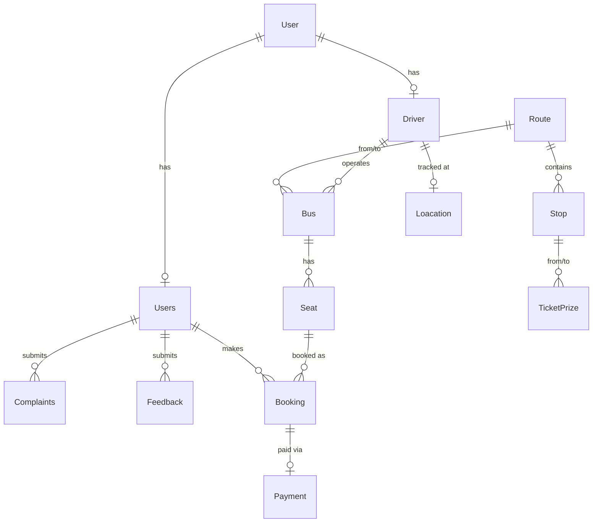

### Models

| Model | Description |
| ----- | ----------- |
| `Driver` | Bus driver profile (linked to Django `User`) |
| `Users` | Passenger profile (linked to Django `User`) |
| `Route` | Bus route with starting point and destination |
| `Stop` | Intermediate stop along a route |
| `Bus` | Bus with name, reg. number, from/to routes, and assigned driver |
| `Seat` | Seat in a bus with seat number and type |
| `TicketPrize` | Fare between two stops |
| `Booking` | Seat booking by a passenger |
| `Payment` | Payment record for a booking |
| `Complaints` | Complaint submitted by a passenger |
| `Feedback` | Feedback submitted by a passenger |
| `Loacation` | Real-time GPS location of a driver |

---

## 🤝 Contributing

1. Fork the repository
2. Create a feature branch (`git checkout -b feature/amazing-feature`)
3. Commit your changes (`git commit -m 'Add amazing feature'`)
4. Push to the branch (`git push origin feature/amazing-feature`)
5. Open a Pull Request

---

## 📷 Screenshots

### 🌐 Web Application

<p align="center">


</p>

### 📱 Mobile Application

<p align="center">

## Homepage
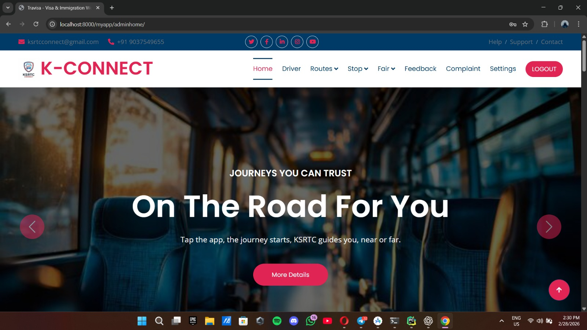

## Driver View
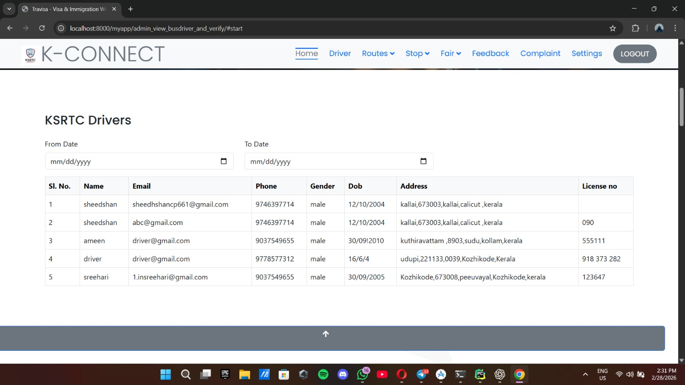

## Login Page
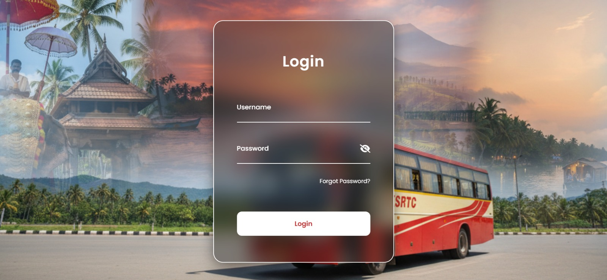

## Route Manage
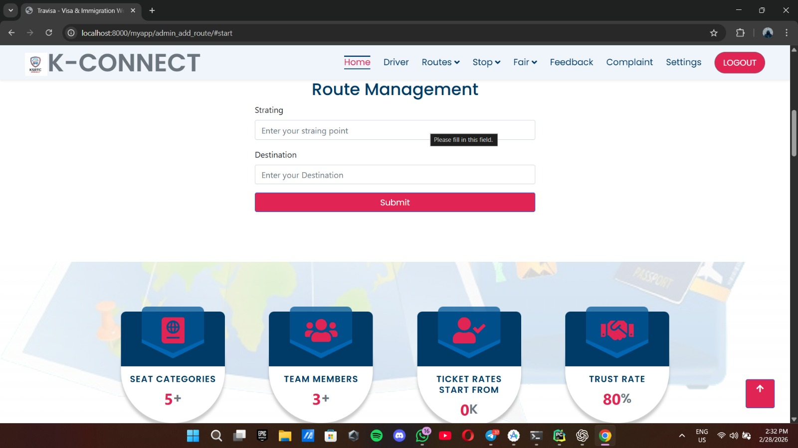

## View Fair
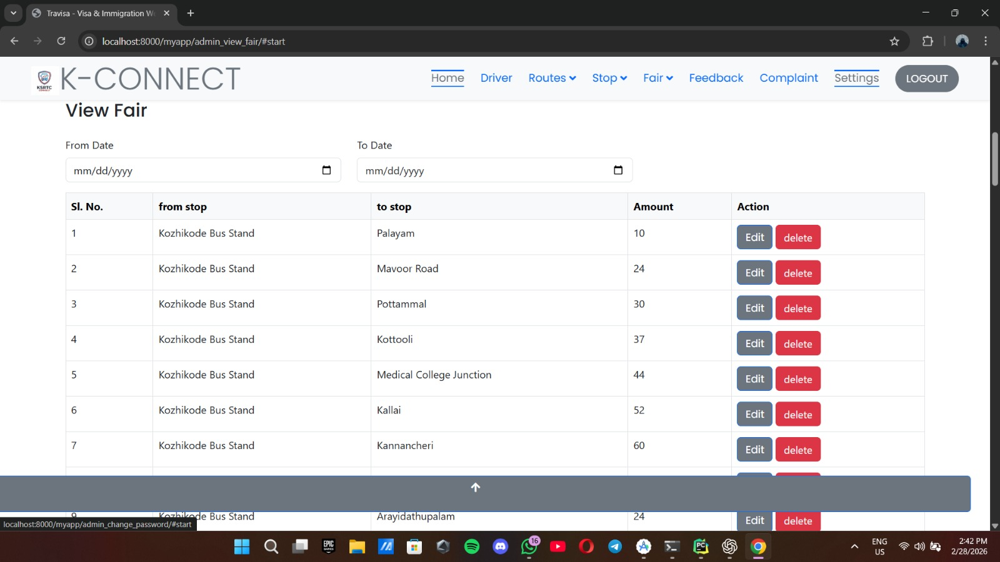

## View Route
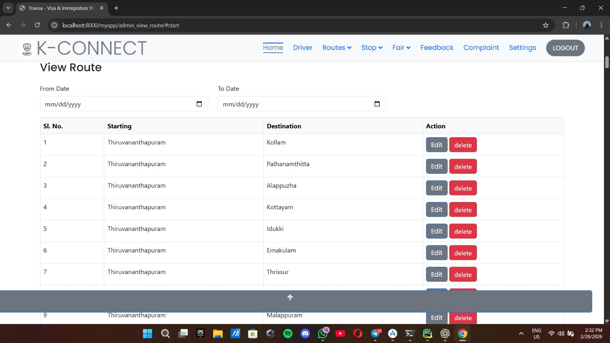

## View Stop
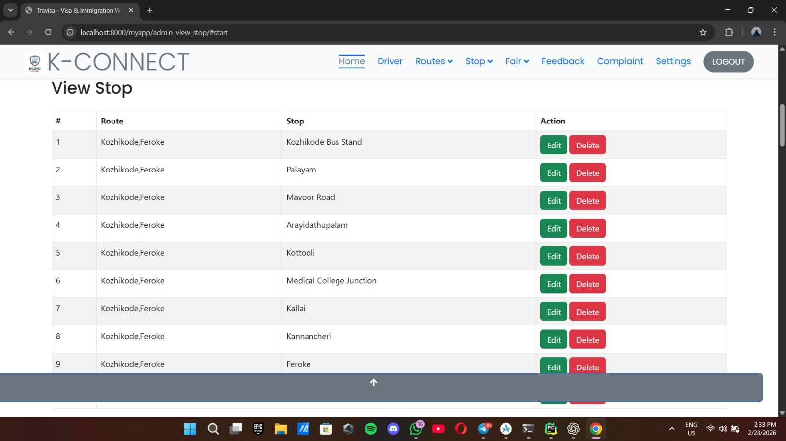

## Add Fair
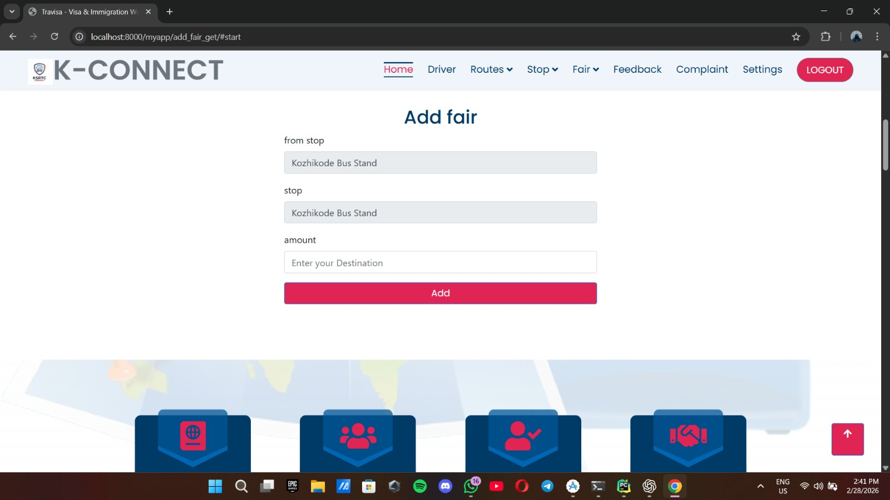

## Add Stop
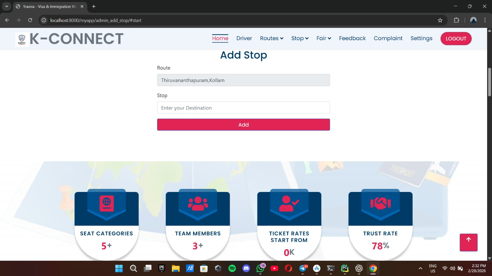

## Feedback
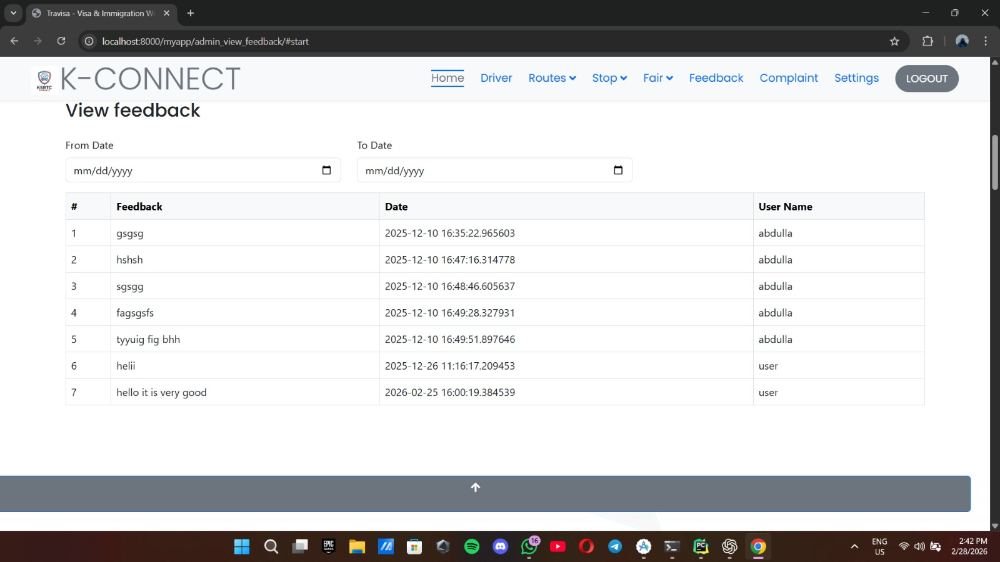

## Complaints
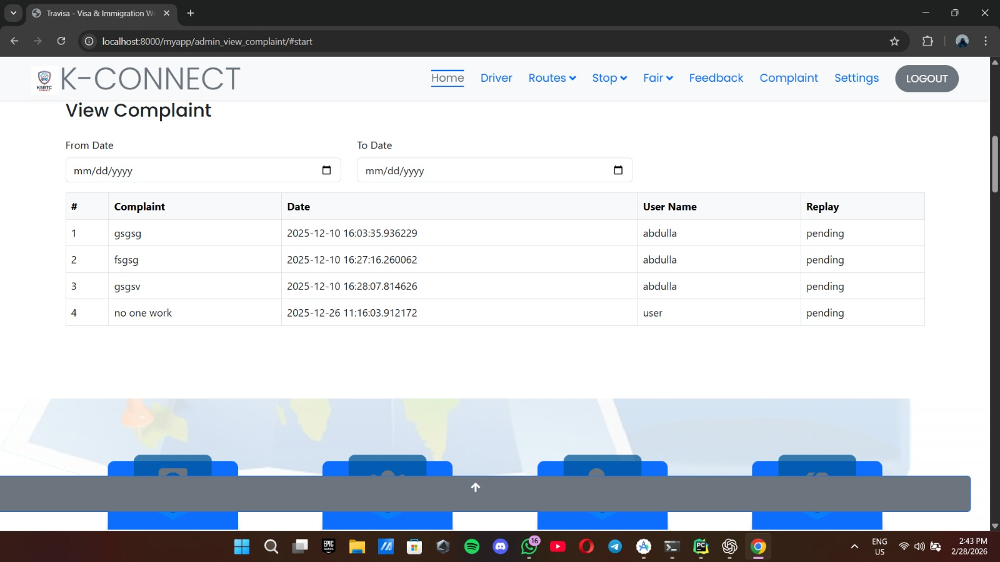

## Change Password
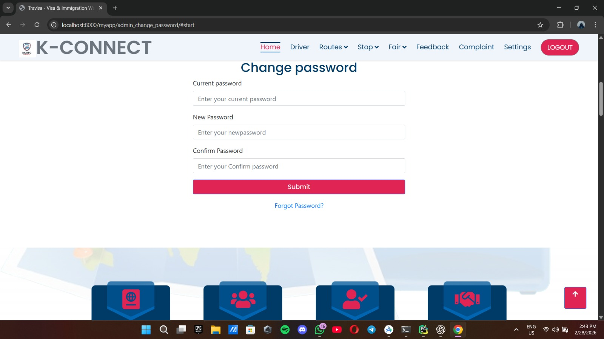


</p>

---

## 📬 Contact

For any queries or collaboration:
- Email: your-email@example.com
- GitHub: https://github.com/your-username

---

## 📄 License

This project is open-source and available under the [MIT License](LICENSE).

---

<p align="center">
  Made with ❤️ for KSRTC
</p>
